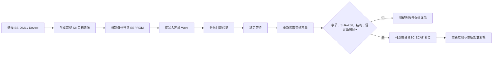
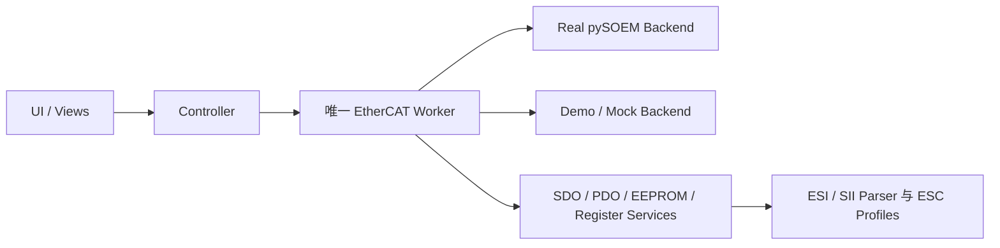

<h1 align="center">EtherCAT Workbench</h1>

<p align="center"><strong>面向 Windows 的 pySOEM EtherCAT 从站调试与诊断工作台</strong></p>

<p align="center">从总线发现、状态切换和在线 I/O，到 SDO、PDO、ESC 寄存器与 EEPROM，提供安全、可追踪、可在无硬件环境演示的统一桌面工具。</p>

<p align="center">
  <a href="https://www.microsoft.com/windows/"></a>
  <a href="https://www.python.org/"></a>
  <a href="https://doc.qt.io/qtforpython-6/"></a>
  <a href="https://github.com/bnjmnp/pysoem"></a>
  <a href="LICENSE.md"></a>
</p>

<p align="center">
  <a href="README.md">简体中文</a> ·
  <a href="README.en.md">English</a> ·
  <a href="#功能概览">功能概览</a> ·
  <a href="#使用者指南">使用指南</a> ·
  <a href="#写入安全机制">安全说明</a> ·
  <a href="#参与贡献">参与贡献</a>
</p>

---

> [!IMPORTANT]
> 应用默认以 **Demo / Mock** 模式启动，不会连接网卡或写入硬件。Real 模式下的 PDO 输出、ESC 寄存器和 EEPROM 写入可能影响机械设备或使从站暂时不可用，请只在隔离、安全的测试环境使用。

## 为什么使用 EtherCAT Workbench

EtherCAT Workbench 是一款便携、易用的 **EtherCAT 从站调试工具**，支持从站扫描与状态控制、SDO/PDO、在线 I/O、ESC 寄存器、ESI/SII 和 EEPROM 诊断与维护。

它将常见的从站调试任务集中在一个明确的操作动线中，并把 pySOEM 请求隔离到唯一的通信线程：

| 关注点 | 实现方式 |
| --- | --- |
| 上手安全 | 默认 Demo / Mock；未连接时不执行硬件写入 |
| GUI 响应 | GUI 线程不调用 pySOEM，不被总线操作阻塞 |
| 请求一致性 | 同一 Master 的 PDO、SDO、EEPROM 和寄存器请求由唯一 `EtherCAT Worker` 串行调度 |
| 写入控制 | PDO 输出、寄存器和 EEPROM 均有显式启用、确认、验证或备份步骤 |
| 无硬件开发 | Mock Backend、Demo 数据和自动化测试无需 EtherCAT 设备 |
| 可追踪性 | 状态、WKC、超时、错误和写入审计日志始终可见 |

底层 EtherCAT 主站通信使用 [pySOEM](https://github.com/bnjmnp/pysoem)。Windows Real 模式依赖 [Npcap](https://npcap.com/)；本仓库和安装包均不包含或再分发 Npcap。

## 功能概览

| 模块 | 已实现能力 |
| --- | --- |
| 总线与状态 | 网卡枚举、连接/断开、从站扫描、身份信息、AL Status、INIT/PRE-OP/SAFE-OP/OP 直接切换 |
| CoE / SDO | 普通 SDO 手动读写（`ca=False`）、在线 SDO Info 对象字典、ESI 回退、基础类型编解码 |
| PDO 映射 | 实际 Assignment/Mapping 读取、ESI 名称与类型补全、字节偏移和位偏移 |
| 在线 I/O | 周期 PDO 收发、原始输入、受控输出、Actual/Expected WKC、超时与错误计数 |
| ESI / SII | XML 导入与拖放、最近文件、多 Device 选择、SII 解析和完整镜像生成 |
| EEPROM | 全量读取、BIN/JSON 备份、差异 Word 写入、完整回读、逐字节与 SHA-256 校验、恢复 |
| ESC 寄存器 | 标准地图、原始访问、位域编辑、RW/W1C/W1S/WO/自清零/易变语义、监视列表 |
| ESC Profile | E101、E252、E253、ET1100、LAN9252、LAN9253、Generic ESC 独立建模 |
| 日志与设置 | UI 日志、轮转 JSONL、写操作 `AUDIT` 记录、设置自动保存 |

## 使用者指南

### 安装与启动

从项目的 [GitHub Releases](https://github.com/LINLin190/EtherCAT-Workbench/releases) 下载：

```text
EtherCATWorkbench-<版本>-Setup-x64.exe
```

安装后可直接运行，无需单独安装 Python。安装器会检查 Npcap 版本和 WinPcap 兼容模式；不满足要求时，会在用户确认后从 Npcap 官方网站下载 1.88。拒绝下载不会中止安装，Demo / Mock 模式仍可正常使用。

> [!NOTE]
> 当前本地构建产物位于 `release\EtherCATWorkbench-0.1.0-Setup-x64.exe`。只有维护者上传 Release 后，GitHub 下载入口才会出现。

### 系统与 Npcap 要求

| 项目 | 要求 |
| --- | --- |
| 操作系统 | Windows 10/11 x64 |
| Python | 3.11 或更新版本；安装包用户不需要预装 |
| pySOEM | 固定使用官方 Windows wheel `pysoem==1.1.13` |
| Npcap | Real 模式需要 1.88 或更新版本 |
| Npcap 选项 | 必须启用 **WinPcap API-compatible Mode** |
| 权限 | 目标网卡可能需要管理员或原始报文访问权限 |
| 网卡建议 | 使用不承载普通网络业务的独立 EtherCAT 网卡 |

应用会在安装阶段和切换 Real 模式时检测 Npcap。Npcap/wpcap 缺失、版本过旧、兼容模式不可用或网卡无法打开时，界面会显示可操作的错误提示。

Npcap 免费版由用户从官方网站单独下载和安装；EtherCAT Workbench 不将 `npcap-1.88.exe` 打入安装包或 Git 仓库。

### 界面与操作动线

基准窗口为 `1440 × 900`，最小支持 `1280 × 720`：

```text
┌───────────────────────────────────────────────────────────────────────┐
│ ① 连接与扫描  │ ② 当前目标与状态  │ ③ 周期通信  │ WKC / 通信状态   │
├───────────────┬───────────────────────────────────┬───────────────────┤
│ Master /      │ 概览 · CoE · PDO 映射 · 在线 I/O │ 当前目标          │
│ Slave 树      │ 寄存器 · EEPROM                  │ 建议下一步        │
│               │                                   │ 高级故障恢复      │
├───────────────┴───────────────────────────────────┴───────────────────┤
│ 日志抽屉（默认收起，发生错误时自动展开）                              │
├───────────────────────────────────────────────────────────────────────┤
│ 网卡 · 从站数量 · 当前目标 · 周期状态 · WKC · Timeout · Errors       │
└───────────────────────────────────────────────────────────────────────┘
```

从站页面固定包含：

| 页签 | 用途 |
| --- | --- |
| 概览 | 身份、状态、AL Status、ESC Profile 和基础健康信息 |
| CoE | SDO 手动访问、在线对象字典和 ESI 回退 |
| PDO 映射 | RxPDO/TxPDO Entry、类型及字节/位偏移 |
| 在线 I/O | 原始输入、受控输出和周期通信指标 |
| 寄存器 | 标准地图、原始地址、位域与监视列表 |
| EEPROM | 读取、查看、备份、生成、烧录、验证和恢复 |

#### 推荐流程

| 步骤 | 操作 | 预期结果 |
| --- | --- | --- |
| 1. 连接 | 选择 Demo/Real 和网卡，点击“连接” | 顶部与状态栏显示已连接 |
| 2. 扫描 | 点击“扫描从站” | 左侧出现 Master 与 Slave 树 |
| 3. 选目标 | 选择 Master 或具体 Slave | 顶部明确显示操作作用域 |
| 4. 切状态 | 直接点击 `INIT / PRE-OP / SAFE-OP / OP` | 当前状态按钮高亮，AL Status 刷新 |
| 5. 读映射 | 按右侧“建议下一步”读取 PDO 映射 | PDO Entry 和偏移可见 |
| 6. 跑周期 | 准备全部从站状态后启动周期通信 | WKC、Timeout、Errors 持续更新 |

“故障恢复（高级）”不属于日常流程：

- **刷新总线状态**：只读刷新从站状态和 AL Status；
- **重新配置从站**：处理仍可通信、但配置或状态异常的从站；
- **恢复丢失从站**：在断线或重新上电后尝试找回从站。

### 写入安全机制

#### PDO 输出

输出修改严格遵循：

```text
监视模式 → 主动开启输出控制 → 编辑待应用值 → 核对目标 → 应用输出
```

自动化测试不会向真实 PDO 输出写入数据。

#### ESC 寄存器

- 默认只读，必须主动开启写入模式；
- 写入前重新读取当前值；
- 显示目标从站、地址、当前值、目标值、变化掩码和最终字节；
- 普通 RW 寄存器写后回读比较；
- W1C、W1S、WO 和自清零寄存器使用语义化验证；
- 未知原始地址允许写入，但明确提示无法检查位语义与副作用；
- 所有寄存器写入进入审计日志。

### EEPROM 工作流

> [!WARNING]
> EEPROM 写入只能在周期通信停止且目标从站处于 INIT 时发起。烧录前必须完成新的全量备份；任何一个回读字节不一致，都不会显示烧录成功。



关键规则：

- 写入目标完全由用户选择的 XML/Device 生成；
- 不从旧 EEPROM 合并 Serial Number、Station Alias 或私有数据；
- 绝不把 XML 文本字节直接写入 EEPROM；
- Vendor ID、Product Code、Revision 不匹配只警告，不阻止；
- XML 无法解析、SII 无法生成、容量不匹配或 EEPROM 无法通信时阻止烧录；
- 完整回读必须逐字节相同，目标与回读 SHA-256 必须一致；
- SII 头部、Size、Version、Category、结束标记、对齐和 XML 语义必须通过；
- EEPROM 镜像校验、ESC 复位、重新发现、重新加载分别显示结果。

校验成功后，默认由独占 Worker 连续发送三个独立 FPWR：

```text
0x0040 ← 0x52
0x0040 ← 0x45
0x0040 ← 0x53
```

三帧之间不会插入 PDO、SDO、EEPROM、寄存器读取或其他 EtherCAT 请求。

#### ESI → SII 转换边界

| 状态 | 元素 |
| --- | --- |
| 已支持 | ConfigData 与 CRC-8、Identity、BootStrap/标准 Mailbox、Mailbox Protocol、Strings、General、FMMU Usage、SyncManager、RxPDO/TxPDO、DC OpMode、标准基础 CoE 类型、BIT1–BIT8 |
| 未声称支持 | 厂商私有 Category、完整自定义 DataTypes 字典、EoE/FoE 协议专属数据、任意 ESI Schema 全覆盖 |

未支持内容会出现在生成报告和 UI 限制说明中，不会被静默忽略或假装已转换。随附 BIN 仅作为独立解析/校验向量，不保证与 XML 生成镜像逐字节相同。

### ESC Profile 与芯片识别

实际芯片型号与寄存器兼容族分开保存：

```text
chip_model = E252
register_family = LAN9252_COMPATIBLE
```

E101、E252、E253 始终显示为独立国产 ESC，不显示成原厂 ET1100、LAN9252 或 LAN9253。识别只依据 ESI 型号文字或 `0x0E00` 芯片类型寄存器，不依据 FMMU/SM 数量或 RAM 范围猜测。

由于尚无三款国产 ESC 的数据手册，厂商私有寄存器、准确 `0x0E00` 编码、EEPROM 时序和复位兼容性仍标记为未验证。

## 开发者指南

### 从源码运行

在 PowerShell 中执行：

```powershell
git clone https://github.com/LINLin190/EtherCAT-Workbench.git
cd EtherCAT-Workbench

py -3.11 -m venv .venv
.\.venv\Scripts\Activate.ps1
python -m pip install -e ".[dev]"

ethercat-workbench
```

也可以使用模块入口：

```powershell
python -m ethercat_debug_tool          # 默认 Demo / Mock
python -m ethercat_debug_tool --real   # 选择 Real Backend
```

`--real` 只选择 Real Backend，不会自动打开网卡、扫描总线或写入硬件。

### 架构



主要原则：

- 窗口类只负责界面编排与用户交互；
- Controller 负责应用状态与异步结果分发；
- Worker 是 Backend 的唯一所有者；
- 同一 Master 的全部 EtherCAT 请求串行执行；
- EEPROM 复位序列可独占 Worker；
- Mock 与 Real Backend 遵循相同接口，不伪造真实硬件验证结果。

### 日志与数据位置

| 内容 | 位置 |
| --- | --- |
| UI 日志 | 主窗口底部日志抽屉 |
| JSONL 日志 | `%LOCALAPPDATA%\EtherCATWorkbench\logs` |
| 写入审计 | 日志中标记为 `AUDIT` |
| 用户设置 | Windows QSettings，组织 `LINLin640`、应用 `EtherCAT Workbench` |

### 构建 Windows 安装包

维护者需要 Windows x64、项目开发依赖和 [Inno Setup 6](https://jrsoftware.org/isdl.php)：

```powershell
python -m pip install -e ".[dev]"
.\packaging\build.ps1
```

构建结果：

| 产物 | 用途 |
| --- | --- |
| `dist\EtherCATWorkbench\` | PyInstaller onedir 应用目录 |
| `release\EtherCATWorkbench-0.1.0-Setup-x64.exe` | 最终用户单文件安装器 |

只构建应用目录：

```powershell
.\packaging\build.ps1 -SkipInstaller
```

构建脚本会检查并拒绝把免费的 Npcap 安装程序打入应用包。项目许可证、第三方声明以及 pySOEM、PySide6、Python、PyInstaller 的许可证材料会随安装内容分发。

### 测试

全部自动化测试使用 Mock Backend 和随附 ESI/BIN 数据，不连接真实网卡，也不写真实 PDO 输出、EEPROM 或寄存器：

```powershell
$env:QT_QPA_PLATFORM='offscreen'
python -m ruff check src tests
python -m pytest
```

当前自动化覆盖包括 Worker、Mock Backend、SDO 编解码、PDO 偏移、ESI/SII、EEPROM 比较、ESC Profile、寄存器语义和 Demo UI 通信闭环。

## 当前限制与真实硬件验证状态

> [!CAUTION]
> Mock 测试通过不等于真实 EtherCAT 硬件验证通过。以下行为仍需要在隔离测试设备上验证。

- Npcap 打开、状态切换、周期 PDO、SDO Info、FPRD/FPWR 和 EEPROM 时序；
- E101/E252/E253 的厂商位域、私有寄存器和准确 `0x0E00` 编码；
- 厂商私有 SII Category 和任意完整 ESI Schema 转换；
- 复杂拓扑下 ESC 复位后的重新发现与 Recover 策略；
- 各 ESC 厂商扩展寄存器的完整覆盖。

首次连接真实硬件时，建议严格按只读顺序验证：

```text
枚举网卡 → 连接 → 扫描 → 状态读取 → SDO/PDO 映射读取
→ 寄存器读取 → EEPROM 全量备份 → 离线保存并确认可解析
```

完成上述验证后，再在隔离、可恢复的测试从站上逐项验证写入操作。

## 许可证

EtherCAT Workbench 按 [PolyForm Noncommercial License 1.0.0](LICENSE.md) 发布，属于**源代码可用软件**，不属于 OSI 定义的开源软件。

允许个人、教育、研究及其他非商业目的使用、修改和分发。未经版权所有者另行书面许可，不得用于商业产品、收费服务、付费支持、商业内部运营或其他商业目的。

分发原版或修改版本时，必须保留：

1. 完整的 `LICENSE.md`；
2. Required Notice 与版权声明；
3. 原项目链接；
4. 对所做修改的明确说明。

修改版本不得暗示其由原作者维护、认可或担保。第三方组件继续适用各自许可证，详见 [THIRD_PARTY_NOTICES.md](THIRD_PARTY_NOTICES.md)。

## 参与贡献

欢迎参与改进 EtherCAT Workbench：

- 通过 [GitHub Issues](https://github.com/LINLin190/EtherCAT-Workbench/issues) 报告缺陷或提出功能建议；
- 补充经过明确标注的真实硬件只读验证结果；
- Fork 仓库，创建范围清晰的修复分支并提交 Pull Request；
- 改进 ESI/SII 兼容性、ESC 寄存器定义、Mock 数据、测试或文档。

提交 Issue 或 Pull Request 时，请尽量包含：

1. 问题现象与复现步骤；
2. 期望行为与实际行为；
3. 涉及的 EtherCAT 从站、ESC 型号、ESI 文件和系统环境；
4. 修改范围和验证方式；
5. 是否接触真实硬件，以及执行了只读还是写入操作。

> [!WARNING]
> 请勿提交会自动写入真实 EEPROM、PDO 输出或 ESC 寄存器的测试，也不要把设备序列号、私有 ESI、生产配置或其他敏感数据提交到公开 Issue。
