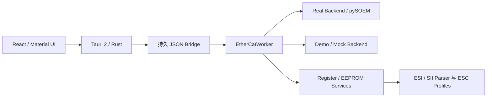

<h1 align="center">EtherCAT Workbench</h1>

<p align="center"><strong>面向 Windows 的 pySOEM EtherCAT 从站调试与诊断工作台</strong></p>

<p align="center">从总线发现、状态切换，到 ESC 寄存器与 EEPROM，提供安全、可追踪、可在无硬件环境演示的统一桌面工具。</p>

<p align="center">
  <a href="https://www.microsoft.com/windows/"></a>
  <a href="https://www.python.org/"></a>
  <a href="https://v2.tauri.app/"></a>
  <a href="https://github.com/bnjmnp/pysoem"></a>
  <a href="LICENSE.md"></a>
</p>

<p align="center">
  <a href="README.md">简体中文</a> ·
  <a href="README.en.md">English</a> ·
  <a href="#功能概览">功能概览</a> ·
  <a href="#使用者指南">使用指南</a> ·
  <a href="#写入安全机制">安全说明</a> ·
  <a href="#参与贡献">参与贡献</a>
</p>

---

> [!IMPORTANT]
> 应用默认选择 **Real** 模式，但启动不会自动打开网卡、连接、扫描或写入硬件。Demo / Mock 仅可在“设置”中启用，并会在界面中明确标识。Real 模式下的状态切换、ESC 寄存器和 EEPROM 写入可能影响机械设备或使从站暂时不可用，请只在隔离、安全的测试环境使用。

## 为什么使用 EtherCAT Workbench

EtherCAT Workbench 是一款基于 **Tauri 2、Rust、React、TypeScript、Material UI 和 Emotion** 的桌面 EtherCAT 从站调试工具，支持从站扫描与状态控制、ESC 寄存器、ESI/SII 和 EEPROM 诊断与维护。Python 通过持久 JSON Bridge 承载 pySOEM 硬件核心，WebView 不直接调用 pySOEM。

它将常见的从站调试任务集中在一个明确的操作动线中，并把 pySOEM 请求隔离到唯一的通信 Worker：

| 关注点 | 实现方式 |
| --- | --- |
| 上手安全 | Real 启动不自动连接；Demo / Mock 需在设置中启用并有明确标识 |
| GUI 响应 | WebView 不调用 pySOEM，硬件工作在 Python Bridge 异步执行 |
| 请求一致性 | 同一 Master 的硬件请求由唯一 Worker 串行调度 |
| 写入控制 | 寄存器使用两阶段计划与回读；EEPROM 使用容量、结构、语义和完整镜像校验 |
| 无硬件开发 | Mock Backend、Demo 数据和自动化测试无需 EtherCAT 设备 |
| 可追踪性 | 状态、AL 状态、超时、错误和写入审计日志始终可见 |

底层 EtherCAT 主站通信使用 [pySOEM](https://github.com/bnjmnp/pysoem)。Windows Real 模式依赖 [Npcap](https://npcap.com/)；本仓库和应用均不包含或再分发 Npcap。

## 功能概览

| 模块 | 已实现能力 |
| --- | --- |
| 总线与状态 | 网卡检测与选择、连接/断开、从站扫描、身份信息、AL Status、INIT/PRE-OP/SAFE-OP/OP 状态请求、重新配置与恢复 |
| ESC 寄存器 | ET1100、LAN9252、LAN9253 目录，搜索、分类、位域、原始地址、固定监视、变化高亮与复制 |
| 寄存器写入 | 绑定从站身份的 60 秒计划、语义化回读校验和 `AUDIT`；原始写入要求 HEX 长度与宽度一致 |
| ESI / SII | XML 选择、拖放、最近文件、多 Device 选择、SII 生成、Smart View 类别/偏移/长度/内容预览与容量检查 |
| EEPROM | 全量读取、BIN 备份、差异 Word 写入、逐 Word 回读、稳定等待、全量复读、字节/SHA-256/结构/身份语义校验与 BIN 恢复 |
| 复位与重发现 | `0x0040` 三帧 ESC ECAT 复位；复位后有界轮询重发现并分别报告重发现与重新加载结果 |
| 状态诊断 | 概览显示总线阶段、最近通信错误、实际从站状态和 AL 状态；设置可切换 AL 状态中文/English |
| 页面范围 | 主导航公开“概览、寄存器、EEPROM、设置”；CoE、PDO 映射和在线 I/O 代码仍保留但本版本隐藏 |

## 使用者指南

### 安装与启动

当前以源码运行优先。Tauri 配置中的 `bundle.active=false`，因此不保证存在安装器或 GitHub Release 安装包。

在 PowerShell 中执行：

```powershell
git clone https://github.com/LINLin190/EtherCAT-Workbench.git
Set-Location "EtherCAT-Workbench\apps\EtherCAT Workbench"
py -3.11 -m venv .venv
.\.venv\Scripts\Activate.ps1
python -m pip install -e ".[dev]"
.\start-desktop.ps1
```

也可以双击 `Start-EtherCAT-Workbench.cmd`。启动器会优先使用全局 pnpm、本机缓存的 Corepack 版本或 Corepack，并只清理项目所属的旧 Vite 进程。Vite 使用端口 `1420`；若被无关进程占用，启动器会报告冲突而不会终止该进程。

仅预览浏览器界面：

```powershell
Set-Location desktop
pnpm install
pnpm dev
```

### 系统与 Npcap 要求

| 项目 | 要求 |
| --- | --- |
| 操作系统 | Windows 10/11 x64 |
| Node.js | 20 或更新版本，配合 pnpm 或 Corepack |
| Python | 3.11 或更新版本 |
| Rust | MSVC 工具链 |
| WebView | Windows WebView2 |
| pySOEM | Real 模式固定使用 `pysoem==1.1.13` |
| Npcap | 1.88 或更新版本，并启用 **WinPcap API-compatible Mode** |
| 网卡建议 | 使用不承载普通网络业务的独立 EtherCAT 网卡 |

Npcap/wpcap 缺失、权限不足或网卡无法打开时，界面会显示可操作的错误提示。Demo / Mock 不会打开物理网卡。Npcap 免费版由用户从官方网站单独下载和安装。

### 界面与操作动线

默认视觉验收分辨率为 `2560 × 1440`，同时检查 `1920 × 1080`；最小支持 `1280 × 720`：

```text
┌───────────────────────────────────────────────────────────────────────┐
│ ① 连接与扫描  │ ② 当前目标与状态  │ ③ 操作进度与通信状态             │
├───────────────┬───────────────────────────────────┬───────────────────┤
│ Master /      │ 概览 · 寄存器 · EEPROM · 设置    │ 当前目标          │
│ Slave 树      │                                   │ 建议下一步        │
│               │                                   │ 高级故障恢复      │
├───────────────┴───────────────────────────────────┴───────────────────┤
│ 日志抽屉（默认收起，发生错误时自动展开）                              │
└───────────────────────────────────────────────────────────────────────┘
```

从站页面固定包含：

| 页签 | 用途 |
| --- | --- |
| 概览 | 身份、状态、AL Status、ESC Profile 和基础健康信息 |
| 寄存器 | 标准目录、原始地址、位域、读取/写入与监视列表 |
| EEPROM | 读取、查看、备份、生成、烧录、验证和恢复 |
| 设置 | Real/Demo 模式、AL 状态语言和应用信息 |

#### 推荐流程

1. Real 模式点击“检测并扫描”，应用会逐个尝试可用网卡并自动保留发现从站的连接；Demo / Mock 在设置中启用。
2. 若自动扫描未发现从站，可在网卡下拉框中选择适配器后手动“连接”和“扫描”。
3. 先读取概览中的实际状态和 AL 状态，再按 `INIT -> PRE-OP -> SAFE-OP -> OP` 顺序请求状态；周期通信运行时状态、重新配置和恢复操作会禁用。
4. 在寄存器页先读取再写入，核对从站、目录、地址、当前值和目标值；超过 60 秒的计划必须重新生成。
5. EEPROM 操作前停止周期通信并使目标从站处于 INIT，先备份 BIN，再选择 XML/Device、检查 Smart View 和容量后执行烧录或恢复。

“故障恢复（高级）”不属于日常流程：刷新总线状态是只读操作；重新配置处理仍可通信但配置异常的从站；恢复丢失从站尝试在断线或重新上电后重新发现从站。

## AL 状态码

概览从 ESC 标准 AL 状态寄存器 `0x0134` 读取状态码，并显示代码、中文/English 名称、详情和排查建议。可在“设置”中切换语言，选择会保存在本地。

| 范围/代码 | 含义 |
| --- | --- |
| `0x0000` | 无错误 |
| `0x0001`-`0x0083`、`0x00F0` | 内置常见目录，覆盖固件/SII、状态切换、Mailbox、SyncManager、PDO、看门狗、同步、DC、电源、温度和应用控制器条件 |
| `0x8000`-`0xFFFF` | 厂商自定义；界面不猜测含义，应查设备手册、ESI 和厂商诊断对象 |
| 其他值 | 未列出、保留或新扩展候选；重新读取 `0x0134` 并查阅设备资料 |

常见排查方向：

| 分组 | 示例代码 | 首要检查 |
| --- | --- | --- |
| 状态/配置 | `0x0011`、`0x0016`、`0x0017`、`0x0021`-`0x0026` | 当前/请求状态、Mailbox、SyncManager、RxPDO/TxPDO、ESI/SII |
| 看门狗/同步 | `0x001A`、`0x001B`、`0x002A`、`0x002C`-`0x0037` | 周期时间、WKC、Sync0/Sync1、DC 和固件任务负载 |
| Mailbox | `0x0041`-`0x0045`、`0x004F` | 协议、Mailbox 大小、对象字典和诊断日志 |
| EEPROM | `0x0050`、`0x0051` | EEPROM 控制/状态/错误寄存器和 SII 镜像 |
| 电源/环境 | `0x0080`-`0x0083` | 供电、散热、环境和外部就绪信号 |

完整双语逐码目录位于 [al_status_codes.json](src/ethercat_debug_tool/protocol/al_status_codes.json)，未知码会保留原始十六进制值。

### `0x0050` EEPROM no access

`0x0050` 表示 EEPROM 无法访问。该代码本身不能证明 PDI 已接管或 EEPROM 被锁定；`0x0500 == 0` 也不是充分证据。应联合读取 `0x0500`、`0x0501`、`0x0502`，检查 ECAT/PDI 所有权、Busy/错误位，并结合固件状态机、日志和抓包定位。`0x0051` 更接近 EEPROM 读写、应答或校验失败。状态切换失败时，后端会将从站名、实际状态和 `0x0134` 码带入错误信息。

## 写入安全机制

### ESC 寄存器

- 默认只读，写入必须生成计划并显式确认；计划绑定当前会话、完整从站身份和配置地址，60 秒后过期。
- 写入前重新读取当前值，并显示目标、地址、当前值、目标值、变化掩码和最终字节。
- RW、W1C、W1S、WO、自清零和易变寄存器使用语义化验证；未知原始地址明确提示无法判断位语义与副作用。
- 原始地址工具的宽度同时约束读取长度和 HEX 写入字节数，长度不一致会被拒绝；所有写入记录为 `AUDIT`。
- LAN9252 兼容族不会把错误计数器 `0x0300` 当作通用 WAC 写入；如需清零，应提供专用安全操作。
- ESC ECAT 复位 `0x0040` 使用独占、明确确认的 `0x52`、`0x45`、`0x53` 三帧序列。

### EEPROM 工作流

> [!WARNING]
> EEPROM 烧录只能在周期通信停止且目标从站处于 INIT 时执行。身份不符只显示警告，不要求额外确认；任何回读字节、SHA-256、SII 结构或语义不一致，都不会报告镜像校验成功。

```text
选择 XML / Device -> 生成完整 SII 目标 -> 检查容量和 Smart View
-> 读取并备份当前 EEPROM -> 仅写入差异 Word -> 逐 Word 回读
-> 稳定等待 -> 全量复读 -> 字节/SHA-256/结构/语义校验
-> 可选 ESC 复位 -> 有界轮询重发现 -> 重新加载校验
```

烧录或恢复期间，其他硬件命令立即返回 `EEPROM_BUSY`；取消在界面显示为中性的“已取消”。技术详情显示 `first_difference` 偏移，备份完成后显示完整保存路径。复位后的重发现与重新加载分别报告，重发现失败不改变已完成的镜像字节校验结果。

#### ESI → SII 转换边界

| 状态 | 元素 |
| --- | --- |
| 已支持 | ConfigData/CRC-8、Identity、标准 Mailbox、Strings、General、FMMU、SyncManager、RxPDO/TxPDO、DC OpMode、标准基础 CoE 类型、BIT1–BIT8 |
| 未声称支持 | 厂商私有 Category、完整自定义 DataTypes 字典、EoE/FoE 专属数据、任意 ESI Schema 全覆盖 |

未支持内容会出现在生成报告和 UI 限制说明中，不会被静默忽略。Smart View 显示类别、类型、偏移、长度和内容预览。

## ESC Profile 与芯片识别

`chip_model` 与 `register_family` 分开保存。包含 E101、E252、E253、ET1100、LAN9252、LAN9253 和 Generic ESC；国产型号不会显示成原厂芯片。识别依据 ESI 型号文字或芯片类型寄存器 `0x0E00`，不依据 FMMU/SM 数量或 RAM 范围猜测。E101/E252/E253 的厂商寄存器、准确编码、EEPROM 时序和复位兼容性仍需真机资料验证。

## 开发者指南

### 架构



- React 页面负责展示与交互，Tauri Rust 负责桌面生命周期与桥接；
- Python Bridge 是唯一硬件入口，WebView 不直接调用 pySOEM；
- Worker 是 Backend 的唯一所有者，同一 Master 的请求串行执行；
- EEPROM 独占期间立即拒绝其他硬件请求；周期通信期间状态控制、重新配置、恢复和 EEPROM 操作禁用或拒绝；
- `recover()` 返回成功后仍会校验实际状态和 AL 状态，不能只凭布尔值提示恢复完成；
- Mock 与 Real Backend 遵循相同接口，Mock 不代表真机验证。

### 构建 Windows 应用

当前 Tauri 配置为 `bundle.active=false`，不会生成可承诺的安装器。维护者可在 `desktop` 目录执行前端构建，并由 Tauri 工具链生成本地调试/应用产物：

```powershell
Set-Location desktop
pnpm install
pnpm build
```

正式打包前仍需在 Windows x64 上验证 WebView2、Python Bridge、pySOEM 和 Npcap 的部署边界；Npcap 不会被打入应用包。

### 日志与数据位置

| 内容 | 位置 |
| --- | --- |
| UI 日志与进度 | 应用窗口内 |
| Bridge JSONL 日志 | `%LOCALAPPDATA%\EtherCATWorkbench\logs` |
| 写入审计 | 同一日志目录，标记为 `AUDIT` |
| EEPROM BIN 备份 | EEPROM 页面显示完整路径 |
| Bridge 异常退出 | 页面显示 stderr 与 `log_path`，可打开日志位置 |

### 测试与构建检查

```powershell
python -m ruff check src tests
python -m pytest -q
Set-Location desktop
pnpm build
pnpm test
```

当前视觉验收基准为 `2560 × 1440`（默认）、`1920 × 1080` 和 `1280 × 720`（最低）。

## 当前限制与真实硬件验证状态

> [!CAUTION]
> Mock 测试通过不等于真实 EtherCAT 硬件验证通过。

- Npcap 打开、真实状态切换、周期 PDO、EEPROM 时序和复杂拓扑复位后的重发现仍需隔离测试设备；
- INIT → PRE-OP 的 `0x0050`/`0x0051` 固件/PDI 路径需设备资料或抓包；
- E101/E252/E253 的厂商位域、私有寄存器和准确芯片编码需数据手册或硬件捕获；
- 厂商私有 SII Category 和任意完整 ESI Schema 转换不在当前支持范围；
- 标准寄存器目录不代表覆盖每个厂商扩展；CoE、PDO 映射和在线 I/O 页面当前隐藏。

首次接触真机建议只执行：枚举网卡 → 连接 → 扫描 → 读取状态/AL → 读取寄存器 → 读取并离线保存 EEPROM BIN。确认备份可解析且设备处于安全状态后，再在隔离测试从站上验证写入。

## 许可证

EtherCAT Workbench 按 [PolyForm Noncommercial License 1.0.0](LICENSE.md) 发布，属于**源代码可用软件**，不属于 OSI 定义的开源软件。个人、教育、研究及其他非商业用途可按许可证使用、修改和分发；商业产品、收费服务、商业内部运营和付费支持需另行书面许可。分发时请保留完整许可证、Required Notice、版权声明、项目链接并说明修改内容。第三方组件遵循各自许可证，详见 [THIRD_PARTY_NOTICES.md](THIRD_PARTY_NOTICES.md)。

## 参与贡献

欢迎通过 [GitHub Issues](https://github.com/LINLin190/EtherCAT-Workbench/issues) 报告缺陷、提出建议或补充明确标注的真机只读验证结果。请提供复现步骤、期望/实际行为、从站与 ESC 型号、ESI 文件、系统环境和验证方式；不要提交会自动写入真实 EEPROM、PDO 输出或寄存器的测试，也不要公开设备序列号、生产配置或私有 ESI。
